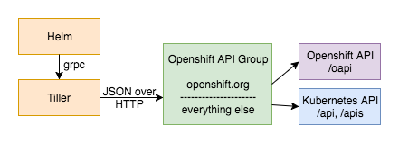

# Openshift API Group

A reverse proxy server that aims to make [Openshift](https://www.openshift.org/) resources work with [Kubernetes](https://kubernetes.io/) tools, namely [Helm](https://helm.sh/).

### Rationale

Kubernetes is complicated.  Helm facilitates usage by providing the ability to install packages, which are configurable services (see [here](https://kubeapps.com/) for examples).  Openshift extends Kubernetes with new features, such as the ability to define a docker build that runs in the cluster.  It also add templates, which are similar to Helm charts (packages), but they use a very limited templating construct.

Unfortunately, Helm cannot be used with Openshift resources because it only knows how to talk to the Kubernetes API.  This project solves that issue without having to fork Helm.


### Getting Started

A Helm chart is provided to make installation easy.  However, since this proxy has not yet been installed, you will need the [Helm template](https://github.com/technosophos/helm-template) plugin to use it.  The chart is published with [the release](https://github.com/megalord/openshift-api-group/releases/latest) so you do not need to clone the whole repo.

I recommend you read the [Access](#access) section document before installing Tiller to make sure the installation is configured to your needs.
```
$ helm template chart | oc create -f -
```

This will install the proxy and Helm's Tiller server into `kube-system` namespace of the Openshift cluster.  At this point, the `tiller` service account will not have access to any other namespaces, meaning it cannot be used to install any charts.  Further, only cluster admins or the current namespace's admin can use Helm.  The intent is to be as secure as possible for a default installation.

The `kube-system` namespace always exists in Openshift.  If you do not have access to it, or you do not want to use it, you can pass `--set namespace=<other namespace>` to `helm template`.  That namespace must already exist.  When using Helm thereafter, you must `export TILLER_NAMESPACE=<other namespace>` to let Helm know where the Tiller server is.


### Access

#### For Helm

As mentioned above, cluster admins can always use Helm.  If you pass `--set createUsersRole=true` to `helm template`, a cluster role named `helm-users` will be created.  It can be used to grant Helm access to users who are not cluster admins.  This is done via
```
$ oc edit rolebindings/helm-users
```


#### For Tiller

There are two options for giving Tiller the access it needs to install charts.

1) Grant access on a per-namespace basis

After a project has been created via `oc new-project` or the Origin web console, create a role binding between the admin role and the tiller service account.  This can be done on the Service Accounts tab of the Resources > Membership page or via the CLI:
```yaml
apiVersion: v1
kind: RoleBinding
metadata:
  name: tiller-access
subjects:
- kind: ServiceAccount
  name: tiller
  namespace: kube-system
roleRef:
  kind: Role
  name: admin
```
```
$ oc create -f <filename>
```

2) Grant access to the entire cluster

This can be done as part of the install by passing the `--set clusterAdmin=true` flag to `helm template`.  It can also be done to an existing installation via:
```
$ oc adm policy add-cluster-role-to-user cluster-admin system:serviceaccount:kube-system:tiller
```

Warning: this means a Helm user can freely create brand new namespaces and new objects in any existing namespace.


### How It Works

tl;dr:



Tiller parses the content of a chart in order to figure out which endpoint of the Kubernetes API to hit.  For example, creating a resource defined by
```yaml
apiVersion: extensions/v1beta1
kind: Deployment
metadata:
  name: myapp
  namespace: helloworld
```
would result in a POST request to `/apis/extensions/v1beta1/namespaces/helloworld/deployments`.

However, to create an Openshift resource such as a BuildConfig, a request needs to be made to `/oapi/v1/namespaces/helloworld/buildconfigs`.  As you can see, Openshift defines it's own api on a separate base path.  Tiller does not know to route a BuildConfig to that route (nor should it).

The Kuberenetes API is designed to be automatically discoverable.  The `/apis` endpoint returns a list of APIGroups that document their own subpaths, and the `/apis/<group>/<version>` endpoint lists the resources that group defines.  Helm uses these along with others to figure out what groups are valid and where to dispatch them.  This design allows for concepts like [Aggregated API Servers](https://github.com/kubernetes/community/blob/master/contributors/design-proposals/aggregated-api-servers.md), which allows anyone to extend the Kubernetes API.  Perhaps in the future, Openshift will be implemented as an API server that registers with the `kube-aggregator`, making this project obsolete.

This service intercepts requests from Tiller to the Kubernetes API and mades a few modifications.

1) Add an APIGroup named openshift.org to the response of `/apis`.

2) Reroute requests matching `/apis/openshift.org/*` to `/oapi/*`.

3) Strip the group name (openshift.org) from the request body for any route matching #2 and add it back into the response body.

With this in place, Tiller can gracefully handle resources such as
```yaml
apiVersion: openshift.org/v1
kind: BuildConfig
metadata:
  name: myapp
```
which means we can develop charts for Openshift, and use Helm to deploy them!

Note that this resource is *NOT* compatible with the `oc create` CLI, because Openshift does not recognize the `openshift.org` api group.  This is an unfortunate side effect, but it can be remedied by building the group transformation into a separate binary.  That is a future goal of this project.


### What About Third Party Resources?

Support for TPRs is what originally motivated Helm to support generic objects in its charts, at least from an outsider's perspective based on [this issue](https://github.com/kubernetes/helm/issues/1468).  However, TPRs are only useful if a separate service is constructed to watch for create, update, or delete operations on those resources.  This makes the workflow asynchronous, introducing additional latency and hampering validation.
